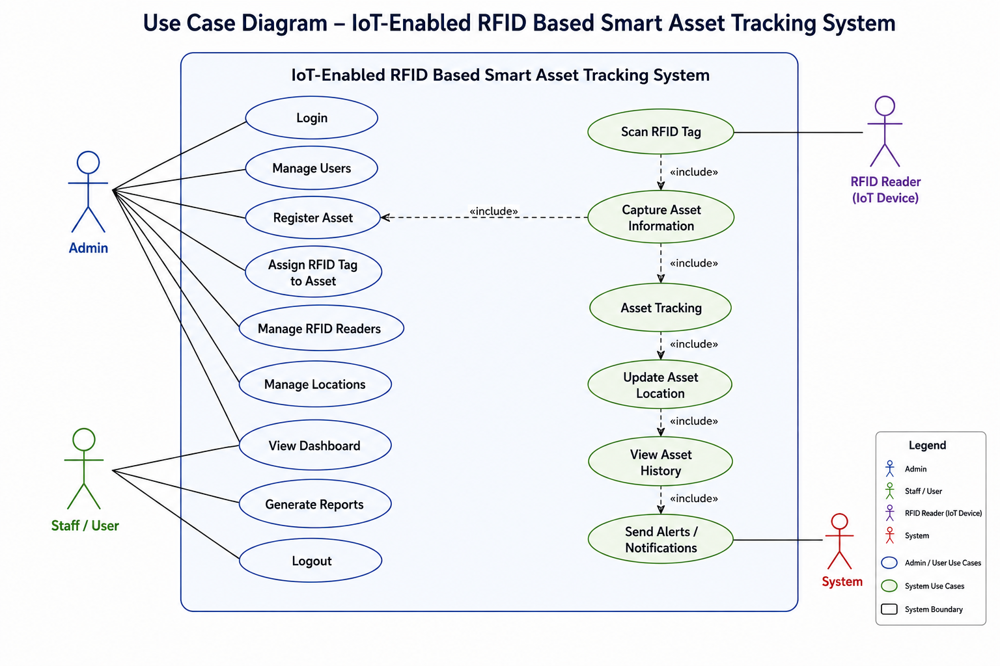

# IoT-Enabled RFID Based Smart Asset Tracking System

An IoT-enabled RFID-based smart asset tracking system designed to automate asset identification, location tracking, and inventory management using RFID technology and IoT communication.

## Overview

This project provides a smart solution for tracking and monitoring organizational assets in real time. By integrating RFID tags, RFID readers, and IoT devices, the system enables automatic asset identification, movement tracking, and centralized monitoring through a web-based dashboard.

## Key Features

- RFID-based asset identification
- Real-time asset tracking
- IoT-enabled data communication
- Asset registration and management
- Dashboard and analytics
- Inventory reporting
- Alert and notification system
- Secure user access control

## Technology Stack

### Frontend
- HTML
- CSS
- JavaScript

### Backend
- Node.js
- Express.js

### Database
- MySQL

### Hardware
- RFID Reader
- RFID Tags
- ESP32 / ESP8266

## Project Documentation

Detailed project information can be found in:

- [Project Details](ProjectDetails.md)

## Diagrams

### ER Diagram


### Use Case Diagram



## Repository Structure

```text
IoT-RFID-Smart-Asset-Tracking-System
│
├── README.md
├── ProjectDetails.md
├── ER diagram.png
└── use_case_diagram.png
```

## Author

Mahisa07
